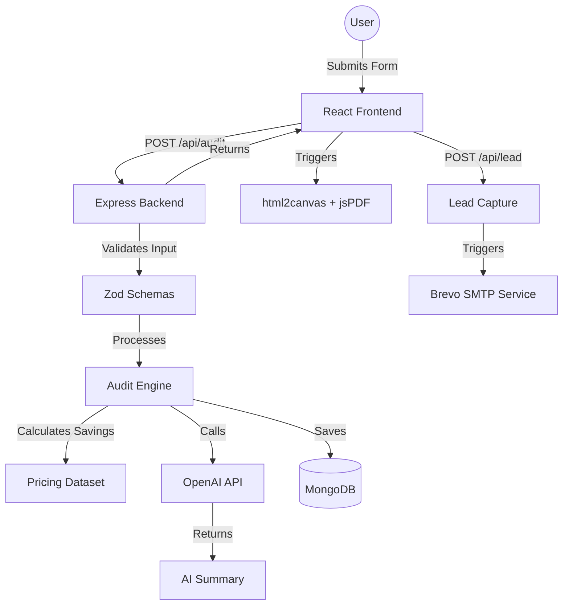

# System Architecture

AI Spend Audit is a full-stack MERN application built with a focus on type safety, deterministic financial logic, and performance.

## System Overview

## Core Components

### 1. Audit Engine (`server/services/auditEngine.ts`)
The "brain" of the application. It uses a rule-based approach to ensure financial accuracy.
- **Deterministic**: Logic is based on fixed pricing plans and team size constraints.
- **Modular**: Separate handlers for single-tool audit, cross-tool recommendations, and credit-based optimizations.

### 2. PDF Generation (`client/src/utils/downloadPdf.ts`)
A custom client-side solution using `html2canvas` and `jsPDF`.
- **Hybrid Approach**: Renders a hidden, optimized version of the report dashboard to capture as an image, then splits it into a multi-page PDF document.
- **Theme Support**: Synchronizes colors and fonts with the application's design system.

### 3. AI Service (`server/services/openAIServices.ts`)
Generates high-level summaries using OpenAI's GPT models.
- **Graceful Fallback**: If the API fails or hits rate limits, the system provides a structured "Deterministic Summary" based on the audit results.

### 4. Data Layer
- **Mongoose Models**: Strict schemas for `Lead` (captured emails/company info) and `Report` (audit results and shareable IDs).
- **Zod**: Used for both frontend form validation and backend request body validation.

## Performance Decisions

- **Lazy Loading**: Heavy visualization components (Recharts) are lazy-loaded to keep the initial landing page bundle under 200KB.
- **Code Splitting**: The audit engine logic is isolated on the server to keep the client lightweight.
- **Asset Optimization**: Use of system fonts and CSS-only UI elements to minimize layout shift.
