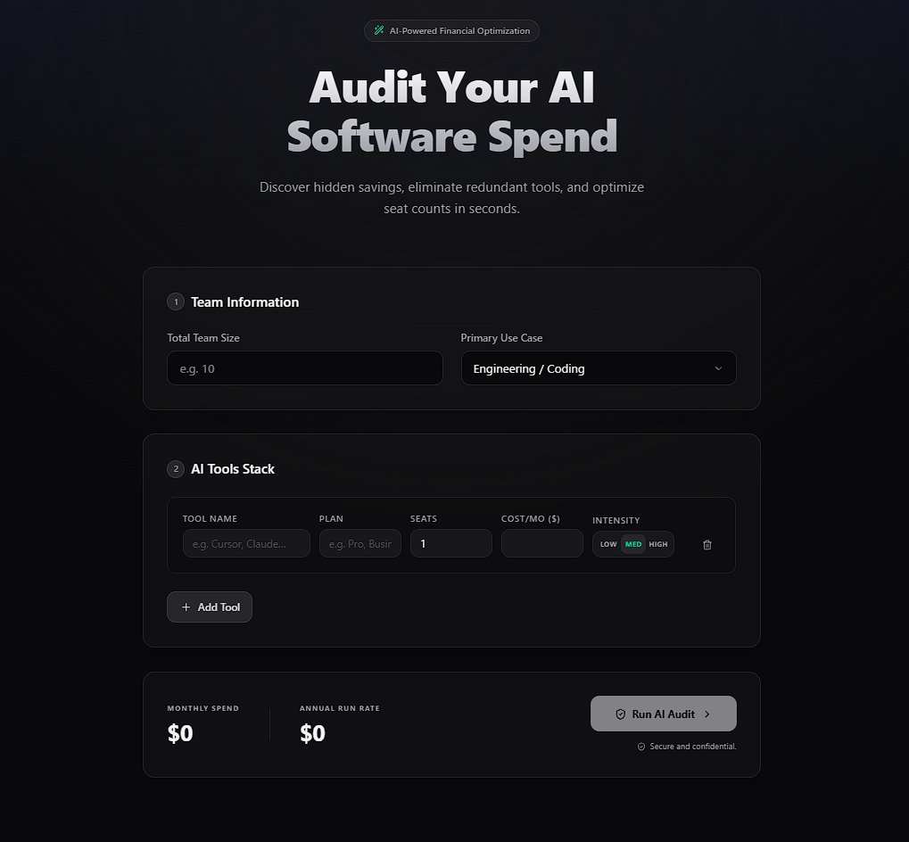
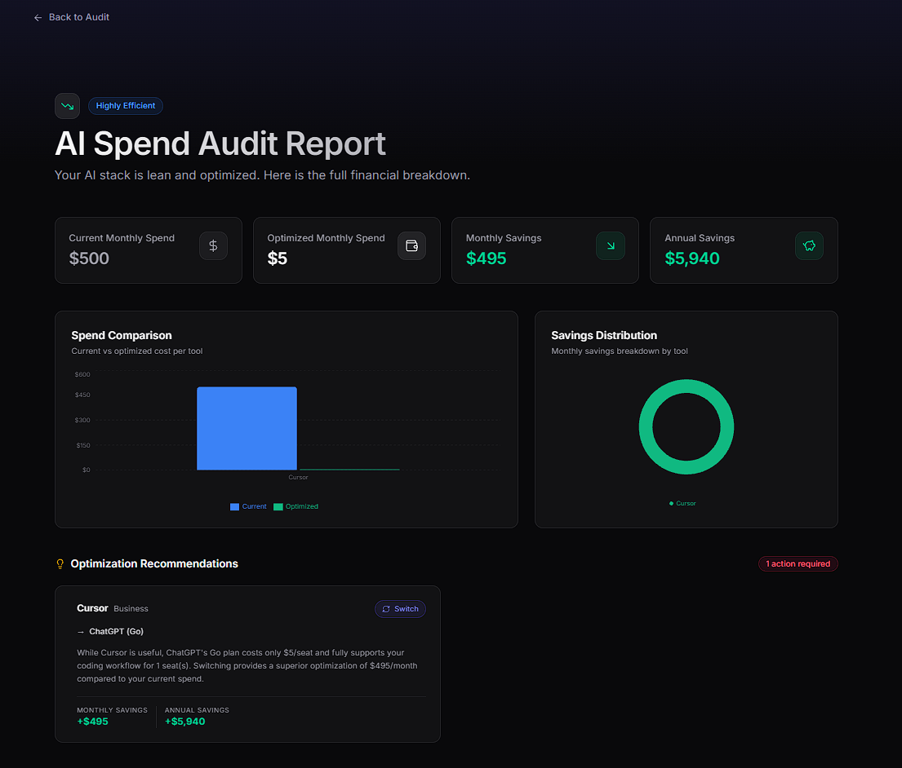
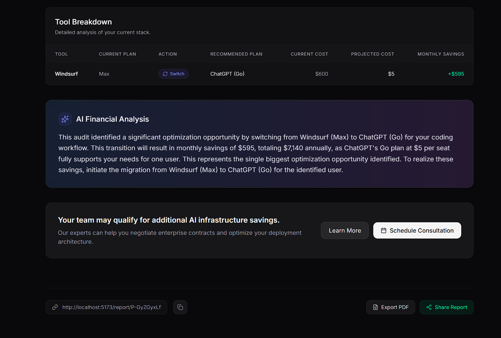
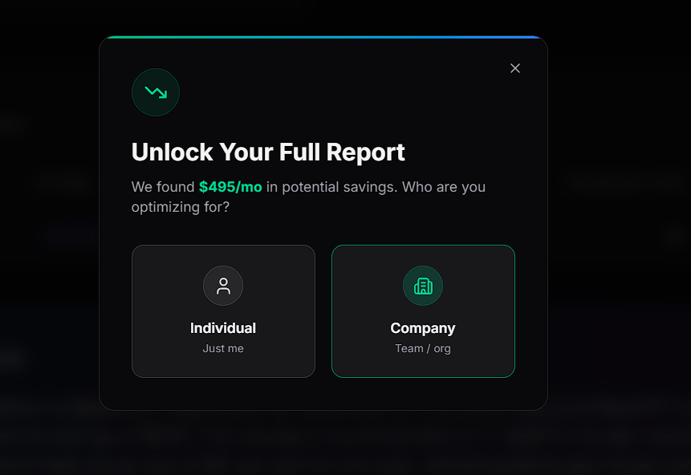
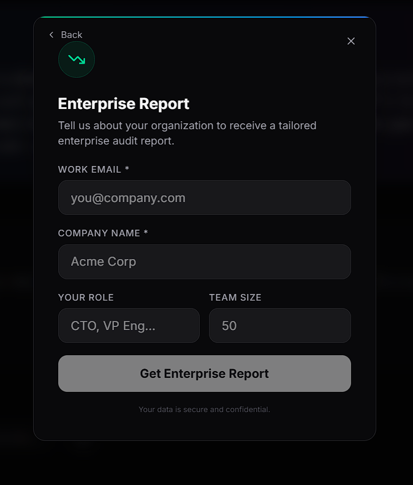
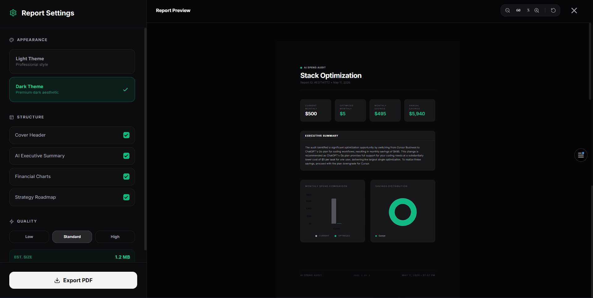

# AI Spend Audit

**AI Spend Audit** is a web application that helps startups, engineering teams or any individual who are spending amount on multiple AI. This tool helps them save cost over AI and recommend them a better version which will save money.

**Live Demo:** https://ai-spend-audit-user.vercel.app/
**GitHub Repo:** https://github.com/aditya060414/ai-spend-audit

---

## Overview

In today’s AI-driven ecosystem, individuals, startups, and companies spend heavily on tools like ChatGPT, Claude, Cursor, GitHub Copilot, Gemini, and API-based AI services to improve productivity and accelerate workflows. However, many teams end up paying for overlapping tools, overpowered plans, or subscriptions that do not match their actual usage patterns.

AI Spend Audit is a web application that helps users analyze and optimize their AI-related spending. Based on factors such as team size, use case, current subscriptions, monthly spend, and usage intensity, the platform recommends better pricing plans, alternative AI tools, and cost-saving opportunities.

The platform generates a detailed audit report showing estimated monthly and annual savings, personalized recommendations, and actionable insights to help teams reduce unnecessary AI expenses while maintaining productivity and efficiency.

---

## Screenshots

### Landing Page



### Report Page





### Lead Capture





### Export PDF



---

## Features

## Core Features

- **Audit Engine**  
  The core logic layer of the application that analyzes the user’s AI tool stack, pricing plans, usage patterns, and team size to generate optimization recommendations and calculate potential monthly and annual savings. It returns a structured `auditSummary` containing recommendations, savings breakdowns, and reasoning.

- **AI-Generated Recommendation Summary**  
  Uses LLM APIs through the `openAIServices` module to generate personalized audit summaries based on the calculated recommendations. If the API request fails or rate limits occur, the system gracefully falls back to a deterministic `showFallbackSummary` response.

- **Email Service**  
  Sends transactional emails containing the generated audit report, public shareable report URL, and savings summary using a reusable email template system.

- **Lead Capture System**  
  Captures user information such as email, company name, role, and team size after the audit is generated. This allows future engagement, optimization notifications, and high-savings consultation outreach.

- **Shareable Public Reports**  
  Every audit report is assigned a unique public share ID, allowing users to revisit or share their optimization reports without exposing sensitive lead information.

- **Savings Visualization Dashboard**  
  Displays detailed savings calculations, recommendation breakdowns, annual projections, and optimization insights through interactive report components and charts.

---

## Technical Features

- **Type-Safe Full Stack Architecture**  
  Built using TypeScript across both frontend and backend for consistent type safety and improved maintainability.

- **Zod Validation**  
  Runtime validation for API requests, audit inputs, and user-submitted form data to ensure predictable and safe data handling.

- **Vitest Test Suite**  
  Automated unit tests covering audit engine logic, recommendation generation, savings calculations, and overlapping tool detection.

- **CI/CD Integration**  
  GitHub Actions workflow configured to automatically run linting and test pipelines on every push to maintain code quality and deployment reliability.

- **Dynamic PDF Report Rendering**  
  Supports dynamically generated PDF-ready audit reports with real-time layout and structure updates based on audit data.

- **Responsive UI & Modern Animations**  
  Responsive user interface built with TailwindCSS and enhanced with Framer Motion animations for improved user experience.

- **Persistent Form State**  
  User input and audit progress persist across reloads to improve usability during longer audit sessions.

- **Rate Limiting & Abuse Protection**  
  Backend API protection using request rate limiting to prevent spam submissions and abuse of audit generation endpoints.

---

## Supported tools

| Tool           | Supported Plans                           | Primary Use Cases                             |
| -------------- | ----------------------------------------- | --------------------------------------------- |
| Cursor         | Hobby, Pro, Business                      | Coding, AI-assisted development               |
| GitHub Copilot | Free, Pro, Pro+, Business, Enterprise     | Coding, Pair Programming                      |
| Claude         | Free, Pro, Max, Team, Enterprise          | Writing, Research, Coding, Mixed Workflows    |
| ChatGPT        | Free, Go, Plus, Pro, Business, Enterprise | Writing, Coding, Data Analysis, Research      |
| Windsurf       | Free, Pro, Max, Team, Enterprise          | AI Coding & Development                       |
| Gemini         | Free, Google AI Pro, Google AI Ultra      | Research, Coding, Writing, Data Tasks         |
| Anthropic API  | Build, Scale                              | API-based AI Applications & Automation        |
| OpenAI API     | Free, Pay-as-you-go                       | AI Integrations, Automation, LLM Applications |
| Gemini API     | Free, Pay-as-you-go                       | AI API Integrations & Generative AI Workflows |

---

## Audit Engine Logic

The audit engine is the core decision-making layer of the platform. It analyzes a user’s AI tool stack, pricing plans, team size, workflow requirements, and usage intensity to generate financially optimized recommendations and calculate potential monthly and annual savings.

The engine is intentionally rule-based instead of AI-driven to ensure deterministic, explainable, and financially defensible recommendations.

### Input Sanitization
- Handles invalid or malformed inputs safely.
- Prevents NaN values and corrupted calculations.
- Validates tool names, pricing plans, and seat counts before processing.

### Pricing Layer
- Uses a normalized pricing dataset for all supported AI tools and plans.
- Separates pricing logic from recommendation logic for maintainability.
- Supports both seat-based subscriptions and API-based pricing models.

### Recommendation Flow
The audit pipeline evaluates:
1. Current plan validity
2. Upgrade or downgrade opportunities
3. Better-fitting plans within the same vendor ecosystem
4. Cross-tool migration opportunities
5. Overlapping subscriptions
6. Credit-based optimization opportunities
7. Savings categorization and lead qualification

### auditSingleTool
Evaluates an individual AI tool entry submitted by the user and validates whether the selected tool and pricing plan exist in the supported pricing dataset. If the tool or plan is invalid, the engine safely returns a structured fallback response without triggering AI-generated summaries.

The module then analyzes:
- whether a cheaper or better-fitting plan exists,
- whether the current plan is underpowered or overkill for the user’s team size and workflow,
- possible upgrade or downgrade opportunities,
- alternative recommendations within the same vendor ecosystem,
- and whether the selected product belongs to API-based usage pricing instead of seat-based subscription pricing.

The final output contains recommendation reasoning, estimated savings, upgrade/downgrade suggestions, and normalized audit metadata used by the main audit engine.

### crossToolRecommendation
Evaluates whether a user can reduce costs further by switching to a different AI tool ecosystem instead of only optimizing within the same vendor’s pricing plans. The module compares compatible alternatives across all supported tools using pricing, seat constraints, workflow compatibility, and estimated savings.

The recommendation engine:
- skips unsupported or custom-priced plans,
- ignores tools the user already uses to avoid duplicate recommendations,
- validates seat compatibility and workflow fit,
- compares projected monthly costs across competing tools,
- and selects the highest-value optimization opportunity.

The module only surfaces cross-tool migration recommendations when the savings are meaningful and financially justified. It generates detailed reasoning explaining why the suggested alternative better fits the user’s use case, team size, and spending profile.

### checkCreditsRecommendation
Determines whether a user qualifies for Credex credit-based optimization opportunities based on their monthly AI spending patterns. The system identifies users paying high retail pricing for AI subscriptions and flags them as eligible for discounted AI infrastructure credits.

The recommendation layer avoids triggering unnecessary credit recommendations for:
- unsupported plans,
- custom enterprise pricing,
- already-optimized setups,
- and usage-based API pricing structures.

For high-spend users with valid optimization potential, the engine replaces generic “keep current plan” recommendations with a Credex-focused savings opportunity, helping surface additional cost reductions without requiring workflow migration.

### consolidateOverLappingTools
Detects redundant AI subscriptions across tools that provide similar functionality and recommends consolidation opportunities to reduce unnecessary spending. The engine evaluates predefined overlap groups such as Cursor vs GitHub Copilot, Claude vs ChatGPT, and API-based alternatives like Anthropic API vs OpenAI API.

The consolidation layer:
- identifies overlapping tools currently used by the user,
- compares their monthly spending,
- preserves higher-priority recommendation states,
- and recommends removing the more expensive overlapping subscription when capability overlap is significant.

The engine prioritizes financially defensible optimizations by ensuring that consolidation recommendations do not reduce workflow capability for the user’s primary use case. Savings calculations include both monthly and annual projections, helping users understand the long-term financial impact of redundant AI tooling.

This module plays a critical role in the audit process because many teams unintentionally subscribe to multiple AI products that serve nearly identical workflows, leading to avoidable recurring expenses.

### Savings Categorization
The engine classifies users into savings categories (`optimal`, `low`, `medium`, `high`, `critical`) based on projected monthly savings. These categories are used to personalize report messaging, prioritize recommendations, and trigger high-value Credex consultation flows.

### Design Philosophy
The engine prioritizes:
- Explainable financial reasoning
- Predictable outputs
- Realistic optimization recommendations
- Workflow compatibility preservation
- Transparent savings calculations

This architecture ensures the generated audits remain understandable, trustworthy, and practical for both individual developers and larger engineering teams.

---

## Project Structure

```text
AI-spend-audit/
├── client/                 # Frontend (React + Vite + TypeScript)
│   ├── public/             # Static assets
│   ├── src/
│   │   ├── assets/         # Images and icons
│   │   ├── components/     # Reusable UI components
│   │   │   ├── pdf/        # PDF generation components
│   │   │   │   ├── PdfPage.tsx
│   │   │   │   ├── PdfReport.tsx
│   │   │   │   └── theme.ts
│   │   │   ├── AISummaryCard.tsx
│   │   │   ├── EnterpriseCTA.tsx
│   │   │   ├── ExportModal.tsx
│   │   │   ├── HeroSection.tsx
│   │   │   ├── HighSavingsCTA.tsx
│   │   │   ├── LeadCaptureModal.tsx
│   │   │   ├── RecommendationsSection.tsx
│   │   │   ├── ReportDashboard.tsx
│   │   │   ├── ShareSection.tsx
│   │   │   ├── SpendChartsSection.tsx
│   │   │   ├── SummaryCards.tsx
│   │   │   ├── ToolBreakdownTable.tsx
│   │   │   └── ToolCard.tsx
│   │   ├── lib/            # API and utility libraries
│   │   │   ├── api.ts
│   │   │   └── utils.ts
│   │   ├── pages/          # Page-level components
│   │   │   ├── LandingPage.tsx
│   │   │   └── ReportPage.tsx
│   │   ├── test/           # Frontend unit and integration tests
│   │   ├── utils/          # Client-side utility functions
│   │   │   └── downloadPdf.ts
│   │   ├── App.css
│   │   ├── App.tsx
│   │   ├── index.css
│   │   ├── main.tsx
│   │   └── types.ts
│   ├── package.json
│   ├── tsconfig.json
│   └── vite.config.ts
├── server/                 # Backend (Node.js + Express + TypeScript + MongoDB)
│   ├── db/                 # Database connection logic
│   ├── middlewares/        # Express middlewares (validation, rate limiting)
│   │   ├── auditValidator.ts
│   │   └── rateLimiter.ts
│   ├── models/             # Mongoose models (Lead, Report)
│   │   ├── Lead.ts
│   │   └── Report.ts
│   ├── routes/             # API route definitions
│   │   ├── audit.ts
│   │   ├── lead.ts
│   │   └── report.ts
│   ├── services/           # Business logic and external integrations
│   │   ├── auditEngine.ts
│   │   ├── emailService.ts
│   │   └── openAIServices.ts
│   ├── index.ts            # Server entry point
│   ├── package.json
│   └── tsconfig.json
├── ARCHITECTURE.md         # System architecture and design decisions
├── DEPLOYMENT.md           # Deployment instructions
├── DEVLOG.md               # Development progress log
├── PRICING_DATA.md         # Raw pricing data for AI tools
├── PROMPTS.md              # AI prompts used in the project
└── TESTS.md                # Testing strategy and results
```

## Getting Started

### Prerequisites

- Node.js (v18+)
- MongoDB

### Installation

1. **Clone the repository**
2. **Setup Server**
   ```bash
   cd server
   npm install
   cp .env.example .env # Add your MongoDB URI and OpenAI API Key
   npm run dev
   ```
3. **Setup Client**
   ```bash
   cd client
   npm install
   npm run dev
   ```

## Tech Stack

- **Frontend**: React, TypeScript, Tailwind CSS, Recharts, @react-pdf/renderer
- **Backend**: Node.js, Express, MongoDB, Mongoose, Zod, Resend (for emails)
- **AI Engine**: OpenAI GPT-4o
- **Testing**: Vitest, React Testing Library
